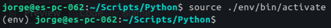
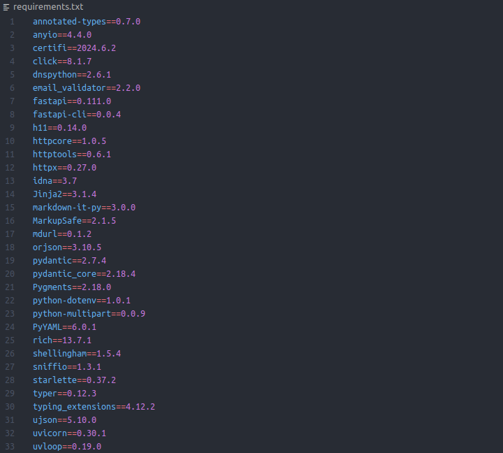

## Entornos virtuales en python
### ¿Qué es un entrono virtual?

Normalmente cuando se ejecuta un script en python, se utiliza el intérprete global instalado en el sistema.

Un entrono virtual es un directorio que contiene una instalación de Python independiente del entorno global. Esto permite instalar paquetes y bibliotecas específicas para este intérprete, sin afectar al entorno global de python.

### ¿Por qué utilizar entornos virtuales?

- **Evitar conflictos de dependencias**\
Cada proyecto puede tener sus propias versiones de paquetes sin interferir con otros proyectos.
- **Reproducibilidad**\
Permite a otros desarrolladores recrear exáctamente el mismo entrono de desarrollo.
- **Aislamiento**\
Si un proyecto requiere una versión específica de una biblioteca, puedes tenerla solo en su propio entorno sin afectar a otros proyectos.

### Instalación, creación y eliminación de un entorno virtual

Existen numerosas herramientas para la creación de entornos virutales. En este caso se va a explicar el proceso mediante **virtualenv**.

Normalmente es necesario **instalar** _virtualenv_ dado que no viene por defecto en python.
```python
pip install virtualenv
```

En la carpeta del proyecto **crear el entorno virtual** con el nombre según preferencia.
```python
virtualenv env
```

Ya creado, para **hacer uso del entorno virtual** y no del entrono global este debe ser activado.

>	[!WARNING]
>	En caso de utilizar control de veriones con **Git**, es importante asegurarse de agregar el directorio del entorno virtual al archivo `.gitignore` para evitar subirlo al repostiorio.

<div align="center">

|           windows          |            Linux           |
|:--------------------------:|:--------------------------:|
| `env\Scripts\activate.bat` | `source env/bin/activate` |

</div>

Una vez se activa, normalmente el prompt de la consola suele indicar que nos encontramos ante un entorno virtual mediante un indicativo como **_(env)_**.

<p align="center">
	
</p>

_Para visualizar esta opción en powerlevel10k, activar virtualenv entre las opciones en el archivo `~/.p10k.zsh`_

De ahora en adelante, todas aquellas <u>dependencias instaladas se aplicarán únicamente para el entorno</u>.

Es por ello que si instalamos una dependencia, si esta no está instalada en el entorno global u otro entorno virtual, no estará disponible.

La forma de **salir de un entorno virtual** es mediante el comando `deactivate`.
>	[!CAUTION]
>	Es posible que en _**zsh**_ a la hora de salir nos den errores de permisos. Hacer uso del comando `source deactivate` soluciona este problema y permite salir del entorno. 

Para **eliminar un entorno virtual** símplemente será necesario eliminar la carpeta `./env` o el nombre que le hayamos dado en la creación del mismo.

### Instalación y desinstalación de librerías

Ya activado un entrono virtual, cualquier librería que se instale mediante **pip** será única de ese entorno virtual. Es posible especificar la versión aunque esto es opcional.

```shell
pip install requests==2.25.1
```

Por otro lado, la forma de desinstalar una librería mediante **pip** es la siguiente:

```bash
pip uninstall requests
```
>	[!NOTE] 
>	Para ver las librerías instaladas, tanto en un entorno global como virutal, podemos utilizar el comando `pip list`.\
>	Mediante el comando `pip show library` veremos información sobre una librería concreta y sus dependencias.
>
>	Puede darse que al importar una librería en python esta no se reconozca porque sea necesario especificar el intérprete en el editor. Este es el caso, por ejemplo, de **_Virtual Studio Code_**.
>	Es una buena práctica generar un archivo **_requirements.txt_** que contenga las dependencias del proyecto. De este modo permite desplegarlo de forma rápida.

#### Generar archivo de requerimientos

```bash
pip freeze > requirements.txt
```
#### Instalar dependencias desde un archivo de requerimientos

```bash
pip install -r requirements.txt
```

Un ejemplo de un archivo de requerimientos sería el siguiente:

<p align="center">
	
</p>

